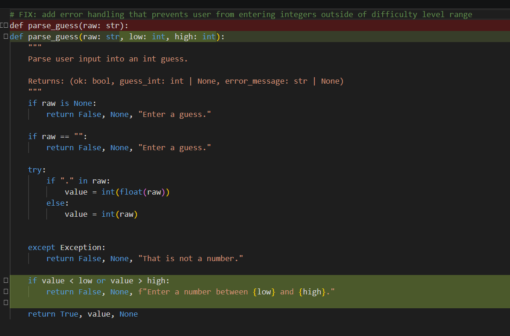
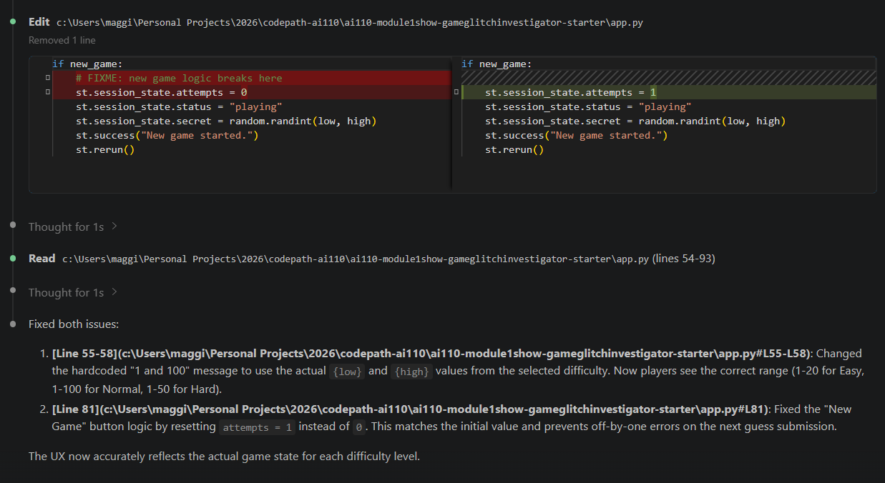

# 💭 Reflection: Game Glitch Investigator

Answer each question in 3 to 5 sentences. Be specific and honest about what actually happened while you worked. This is about your process, not trying to sound perfect.

## 1. What was broken when you started?

- What did the game look like the first time you ran it?

At first glance, the game had a straightforward UI, but when I tried to play the game, several bugs were apparent. I found that the hints were backwards, pressing enter to submit a guess did not work, and that I was unable to start a new game. After encountering those bugs, I decided the second time around, I would test out trying to use up all of my attempts and experimenting with the settings.

- List at least two concrete bugs you noticed at the start  
  (for example: "the hints were backwards").

The two concrete bugs I noticed at the start was that the hints were backwards. For instance, if the secret number is 55, when I submitted a guess greater than the number, it would display feedback telling me to guess higher and vice versa if the guess was lower than 55. The second bug occurred when a user correctly guesses the secret number and decides to start a new game. While the developer debug info updates to a new secret number, the modal telling the user they have won continues to persist and the user is unable to submit guesses for the new game. 

**Bug Reproduction Log**

Document at least 3 bugs you found. Add rows as needed.

| Input | Expected Behavior | Actual Behavior | Console Output / Error |
|-------|-------------------|-----------------|------------------------|
| submitting a guess lower than the secret number/submitting a guess higher than the secret number | displays hint telling user to 'go higher'/displays hint telling user to 'go lower' | displays hint telling user to 'go lower'/displays hint telling user to 'go higher' | None |
| clicking on new game button | removes any feedback modals, new secret number chosen, and user can submit guesses | does not remove the modal, user cannot submit guesses | None |
| user selects a different difficulty level | if the secret number is outside the defined range, its value is reassigned to one within the range | the secret number remains unchanged even if its outside the defined range | None |
| user submits the n-1 guess attempt  | user can use up to the pre-defined number of attempts based on difficulty level | attempts made vs. attempts remaining are not the same and ends the game early for the user | None 

---

## 2. How did you use AI as a teammate?

- Which AI tools did you use on this project (for example: ChatGPT, Gemini, Copilot)? 

I used Claude as my collaborative partner on this assignment. 

- Give one example of an AI suggestion that was correct (including what the AI suggested and how you verified the result).

I told Claude that the user is unable to start a new game when the current game has ended. It correctly identified that the issue originated from the session state status not being reset to "playing," when the new game logic is run. I verified the result by playing two additional games, the first where I guessed the secret number and one where I was unable to guess it before my attempts ran out. Then I clicked on the 'New Game' button. 

In the initial code, when the difficulty level is changed, the secret number is not changed, so that it is within the pre-defined range. In addition, if a user submits a guess that is outside the range, there is no error handling that notifies the user and it still counts the submission as an attempt. I verified the result manually by entering values outside of the pre-defined range. In addition, I had Claude write tests for me that I checked and ran to ensure that it demonstrated the correct behavior. 

- Give one example of an AI suggestion that was incorrect or misleading (including what the AI suggested and how you verified the result).

The number of attempts on the sidebar did not match what was displayed to the user on the main page. While the sidebar displayed the total attempts granted to the user based on the difficulty level, the one shown on the main page was always one less. A quick perusal of the code showed that the attempts variable was automatically set to one even if a user has not submitted a guess, while the displayed 'remaining attempts' was calculated using the attempts subtracted from the total attempts. My prompt to Claude pointed out this discrepancy, but it did not understand what I was conveying and just set the attempts value to 1 when a new game is started. A quick manual check demonstrated that the visual discrepancy still showed and that when I played the game, I was only able to submit n-1 attempts. 

---

## 3. Debugging and testing your fixes

- How did you decide whether a bug was really fixed?

I decided that a bug was fixed only after checking that that the expected behavior occurred during manual testing and if applicable, through pytest. I tried to account for all the variations I could think of after a bugfix, and if I found any issues I would start with reviewing the code changes, looking for issues in the logic, and then prompting Claude to improve the existing solution. 

- Describe at least one test you ran (manual or using pytest) and what it showed you about your code.

One test that I ran was checking that the secret number in the developer's debugging window was within the predefined range set for the corresponding difficulty level. The default state was the game set to Normal. Often times, the secret number would be greater than 50, so I would change the difficulty level to Hard (as the range is 1 to 50), then check if the secret number value was updated to something within that range. Then this process was repeated for Easy (the range is 1 to 20). I ran two checks: a new game was started, then a user changes the difficulty level and mid-game, a user decides to switch the difficulty level. While the secret number value was updated to one within the provided ranges, it revealed that the attempts were not reset, as the session state did not treat it as a new game. That indicated to me that my approach towards handling the attempts bug was not comprehensive enough. 

- Did AI help you design or understand any tests? How?

I used Claude to help me design tests. I would write a prompt concisely explaining the bug, the expected behavior, and the tests to check this behavior. Afterwards, I would review the code suggestions within the files, run pytest, and then do a manual check. If there were additional issues, I would go back to the code and walk through the logic. 
---

## 4. What did you learn about Streamlit and state?

- How would you explain Streamlit "reruns" and session state to a friend who has never used Streamlit?

Streamlit is a framework that allows you to display interactive applications with minimal code. It handles state management using Session State, which allows you to retain variables across sessions/reruns. Session State can be changed using callbacks, which allow you to access/reassign values. 

---

## 5. Looking ahead: your developer habits

- What is one habit or strategy from this project that you want to reuse in future labs or projects?
  - This could be a testing habit, a prompting strategy, or a way you used Git.

Whenever I was prompting AI to solve a bug, I made sure to identify what the issue is, where in the code files it was located, and what the fix would entail. It allowed me to receive outputs that were more likely to match what I was looking for, with minor embellishments on my end.  

- What is one thing you would do differently next time you work with AI on a coding task?

I think the next time I work with AI on a coding task, I want to preemptively determine my own answer to a bugfix. While I sometimes had something in mind before I submitted my prompt, I'm afraid of cognitive offloading that obstructs learning. It doesn't necessarily involve coding the entire solution in advance, but to consider the structure of the solution (i.e. what data structure am I using, is the main problem addressing state management, what edge cases do I need to account for). 

- In one or two sentences, describe how this project changed the way you think about AI generated code.

Collaborating with AI on this project has provided me with mixed feelings. In some ways it requires a developer to think more critically about the outputs they're receiving, but the loss of manually solving a bug makes me worried about how to evaluate if one is truly learning. 